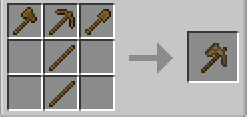

import { Tabs, TabItem } from '@astrojs/starlight/components';
import { Aside } from '@astrojs/starlight/components';
import { Steps } from '@astrojs/starlight/components';

## 概要
このチャプターでは、Minecraftの基本(バニラ)とmekanismの基本を学びます。

## 使用するmod
・Mekanism  
・Mekanism Generators  
・Mekanism tools  

### 1_1.初めてのバニラ＆mekanism Tools
原木、板材と木のツールを辿っていき、木のパクセルを作ります。

これと同じように、石のパクセルと鉄のパクセルも作りましょう。

### 1_2.mekanismの基本
さて、次はmekanismです。青銅のツールを作りましょう。  
熱発電機、基本ユニバーサルケーブル、冶金吹込機を作りましょう。  
作ったら配置します。
    <Aside type="caution" title="熱発電機の向きについて">
        熱発電機の向きはとても重要で、もし間違えてしまうと機械が動かなくなってしまいます。  
        熱発電機の穴があるところから電気の搬出ができます。  
        もしこれを間違えてしまうとユニバーサルケーブルが繋がらなくなってしまうので、気を付けて配置するようにしましょう。
    </Aside>
熱発電機の中に石炭を入れ、冶金吹込機に電気が来ていることを確認します。  
それではクラフトを始めていきましょう。  
    <Steps>
        1. 黄色の枠にレッドストーンダストを4つ、赤色の枠にオスミウムインゴットを2つ入れます。→基本制御回路が2つできます。
        2. 基本制御回路、レッドストーンダスト、溶岩入りバケツ、鋼鉄ケーシングを合わせてクラフトします。→粉砕機ができます。
        3. 粉砕機を配置し、陽インゴットを1つ入れます。→陽の粉ができます。
        4. 銅インゴットを3つ入れます。→銅の粉が3つ出来ます。
        5. 銅の粉、陽の粉を合わせてクラフトします。→青銅の粉ができます。
        6. 青銅の粉を精錬します。→青銅インゴットができます。
    </Steps>
青銅インゴットは鉄などと同じ様にツールを作れるので、斧、シャベル、ツルハシを作ってパクセルを作りましょう。  
これでこのチャプターは終わりです。