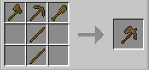

import { Tabs, TabItem } from '@astrojs/starlight/components';

## 概要
このチャプターでは、Minecraftの基本(バニラ)とmekanismの基本を学びます。

## 使用するmod
・Mekanism  
・Mekanism Generators  
・Mekanism tools  

### 詳細
このチャプターではバニラの基本的なクラフトなどについて学びます。  
原木、板材と木のツールを辿っていき、木のパクセルを作ります。

これと同じように、石のパクセルと鉄のパクセルも作りましょう。

さて、次はmekanismです。  
石→鉄と順に作っていったら、青銅のツールを作りましょう。  
熱発電機を作り、基本ユニバーサルケーブルを作りましょう。  
